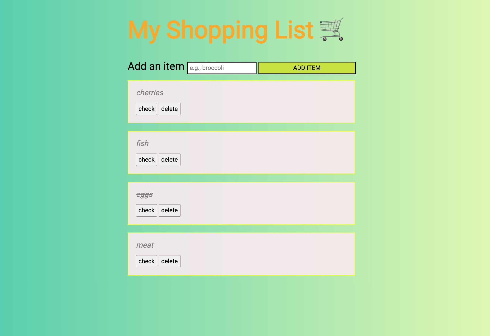

## ✨ Shopping List App Challenge

Una aplicación web simple para gestionar tu lista de compras, construida con jQuery.

## 📸 Screenshot

## Funcionalidades

- ✅ Agregar nuevos artículos a la lista
- ✅ Marcar artículos como completados
- ✅ Eliminar artículos de la lista
- ✅ Interfaz intuitiva y fácil de usar

## Tecnologías Utilizadas

- HTML
- JavaScript
- jQuery
- CSS

## Cómo Usar

1. Escribe el nombre del artículo en el campo de entrada
2. Presiona el botón de enviar para agregar el artículo a la lista
3. Para cada artículo en la lista, puedes:
   - Hacer clic en "check" para marcar/desmarcar como completado
   - Hacer clic en "delete" para eliminar el artículo

## Características Principales

1. **Delegación de Eventos**:
   - Utiliza `.on()` para manejar eventos en elementos dinámicos
   - Los eventos están delegados al contenedor principal `.shopping-list`

2. **Manipulación del DOM**:
   - `.append()` para agregar nuevos elementos
   - `.remove()` para eliminar elementos
   - `.toggleClass()` para alternar estados

3. **Selección de Elementos**:
   - `.closest()` para encontrar el elemento padre más cercano
   - `.find()` para buscar elementos descendientes
   - `.val()` para obtener valores de inputs

4. **Prevención de Comportamientos Por Defecto**:
   - `e.preventDefault()` para controlar el envío del formulario

